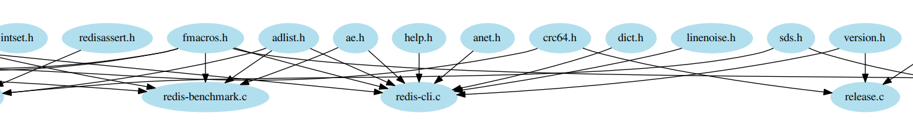
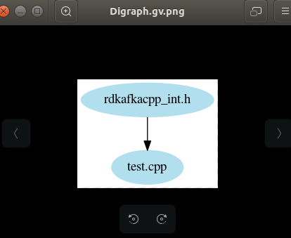
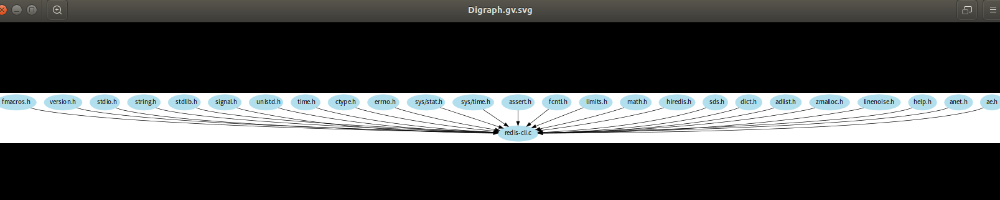

# 利用Python协助解读C/C++程序源码

## 关于作者

微信公众号：


## 导语

终于更新一个小的python项目来一起动手学习了，今天想看看Redis源码，可惜太慢太多，思维太乱，于是想到看是否用Python可以分析出这个源码直接的依赖关系。

这里说的依赖关系指的是，假设有一个C/C++程序，如下`redis-cli.c`：

```
#include "fmacros.h"
#include "version.h"
#include <stdio.h>
#include <string.h>
#include <stdlib.h>
#include <signal.h>
#include <unistd.h>
#include <time.h>
#include <ctype.h>
#include <errno.h>
#include <sys/stat.h>
```

针对这个文件它引入了多个头文件，当很多个c程序放到一块的时候，比如在阅读redis源码的时候，你又是如何知道本地文件之间的依赖关系呢？

是不是很乱，也没有框架感，于是今天这个项目就是解决这种问题，上述就可以得到当前c/c++文件下有多少个头文件，相互之间的依赖关系图。

于是，我们今天这个项目出来了，代码行数很少，但是我个人觉得非常有意思，也非常使用。

下面让我来给大家分析与展示实现思路。展示之前放上我的代码地址，如果你需要，欢迎去下载，非常感谢你可以**顺手star!**

> https://github.com/Light-City/PyLookSrcRelation

## 支持的功能

目前支持如下功能：

- [x] 输出定制，可输出pdf、png、jpg、svg等格式
- [x] 是否展示出系统头文件
- [x] 支持文件夹扫描所有依赖关系
- [x] 支持单个文件依赖关系
- [x] 支持C与C++源码依赖

ok,以上就是目前所有的功能。

如何使用：

clone 下载
```
git clone git@github.com:Light-City/PyLookSrcRelation.git
```

用户设置如下：
-s参数为在c/c++程序中寻找的头文件信息，默认为'#include '
-d参数为文件夹或者c、c++文件
-i参数为包含系统头文件，如果添加这个参数就是包含，不加就是不包含。
-o参数为输出格式，默认值为pdf,可以选择png、svg等
```python
python  pylsr.py -h                                                                                                                                 
usage: search.py [-h] [-s S] [-d D] [-i] [-o O]

Help you understand the source code.

optional arguments:
  -h, --help   show this help message and exit
  -s S, --s S  search xx.c/xx.cpp/xx.h etc
  -d D, --d D  your c/cpp file or c/cpp dir
  -i, --i      if you add this config,it will include the head file
  -o O, --o O  output format
```

只需修改这四个参数，即可实现以上所有功能。

示例1：读取文件夹，解析所有的c/c++程序的头文件依赖关系,并输出pdf格式文件。

```python
python pylsr.py -d './src/' -o 'pdf'
```



示例2：读取文件，解析c++程序的头文件依赖关系，并输出png格式文件。

```python
python pylsr.py -d 'test.cpp' -o 'png'
```


示例3：读取文件，解析c++程序的头文件依赖关系，包含系统头文件，并输出svg格式文件。

```
​```python
python pylsr.py -d 'redis-cli.c' -i -o 'svg'
```


